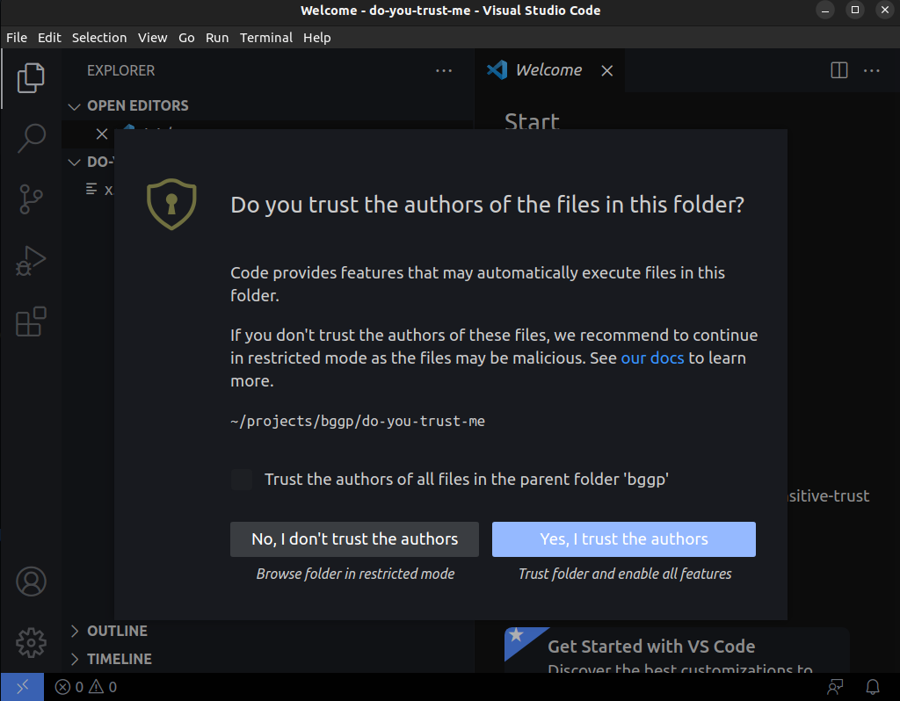

# BGGP4 Entry

This repo contains my entry for [Binary Golf Grand Prix 4](https://binary.golf/) in it's original form (`x.code-workspace`) and also a nicely formatted version (`formatted.json`).

- Target File Type: VSCode workspace file 
- SHA256 Hash: 549982318c91252257391f5b74d87e39eb968a5dd86458b84bbc6b9739d1a3ca 
- Target Environment (How do we run the file?):
    1. Open with VSCode: either via click/right-click on the file, or from VSCode do "File" > "Open Workspace from File..." and select the file.
    2. At the "Do you trust the authors of the files in this workspace?" prompt, select "Yes, I trust the authors".
    3. Wait ~1 second for a terminal to pop and run the command that copies the file and prints the number 4.
- Additional info: 136 characters in length. Tested on Windows 11 and Ubuntu 22.04 with VSCode version: 1.81.1. 

https://github.com/seeinglogic/bggp/assets/114260378/c238833b-8b2c-460a-979a-aae38f374617

## Writeup

Detailed writeup here: https://seeinglogic.com/posts/bggp4-writeup/

## FAQ

- Q: How does this work?
  - A: VSCode allows workspaces to register tasks (commonly for building/watching projects). When you trust a folder, you allow it to run whatever tasks it has registered. This workspace file uses a relative path and an embedded task to accomplish self-replication. 
- Q: When does this not show a trust prompt?
  - A: Whenever the file is within a trusted folder. Trust is based on file locations and is inherited, but you can manage it with a few settings and VSCode's `Workspaces: Manage WorkspaceTrust` command.

